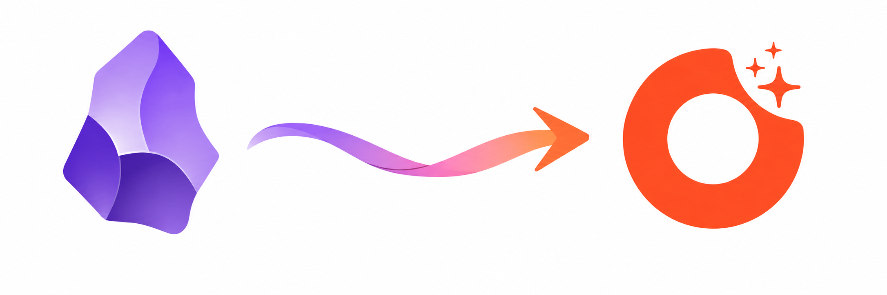

<p align="center">
  
</p>

# ideashell for Obsidian

English | [简体中文](README.zh-CN.md)

Send notes from [Obsidian](https://obsidian.md) to [ideashell (闪念贝壳)](https://ideashell.site) — text, tags, folders and images.
Sync once to create the note; sync again after editing to update the same note. Nothing is duplicated.

把 Obsidian 笔记同步到闪念贝壳：正文、标签、文件夹、图片一起过去。第一次同步新建，之后同步原地更新，不会重复。

## Features

| | |
|---|---|
| **Sync current note** | Command palette, ribbon icon, or right-click a file. |
| **Sync a folder** | Right-click a folder in the file explorer → *Sync folder to ideashell*. Recursive. |
| **Sync a selection of files** | Cmd/Ctrl-click several files (or folders) → right-click → *Sync N notes to ideashell*. |
| **Send selected text** | Select text in the editor → right-click → *Send selection to ideashell*. Creates a standalone quick note. |
| **Sync all** | Sends every note marked with `ideashell: true` plus everything under the folders listed in settings. |
| **Folder mapping** | `Reading/2026/note.md` lands in an ideashell folder named `Reading/2026`. ideashell folders are flat, so the Obsidian path is used as the name. Moving or renaming the folder moves the note on the next sync. |
| **Tags** | Frontmatter `tags` and inline `#tags` become ideashell tags; an `obsidian` tag is added so you can filter these notes (configurable). |
| **Images** | Local images embedded as `![[photo.png]]` (PNG/JPEG/GIF/WebP, ≤ 9 per note, ≤ 10 MB each) are uploaded and attached. Images added later are attached on the next sync. |
| **Auto re-sync** (off by default) | A note that was synced before is re-sent a few seconds after you stop editing it. New notes are never sent without you asking. |

Sync is **one-way**: Obsidian → ideashell. Edits made in the ideashell app do not flow back.

## Setup

1. Install the plugin — Community plugins → search **ideashell**, or add this repository in [BRAT](https://github.com/TfTHacker/obsidian42-brat).
2. In ideashell (web or app) open **Settings → MCP / connections** and copy your **access key**.
3. Obsidian → Settings → **ideashell**: choose your region (China / Global), paste the key, click **Test**.

## Usage

### Sync one note
Open the note and run **Sync current note to ideashell** (`Cmd/Ctrl+P`), click the shell icon in the ribbon, or right-click the file. The first run creates the note; later runs update it. If nothing changed you get *already up to date* and no request is made.

### Sync a folder or several files
Right-click a folder → **Sync folder to ideashell (N notes)**. Or select multiple files with Cmd/Ctrl-click and right-click → **Sync N notes to ideashell**. Progress is shown in a notice; the summary reads `created / updated / unchanged / failed`. Safe to repeat — unchanged notes are skipped.

### Send a snippet
Select text → right-click → **Send selection to ideashell**. The first line becomes the title. This creates a new note every time and is not tracked in frontmatter.

### Keep a set of notes in sync
- Run **Mark current note for ideashell sync** to add `ideashell: true` to a note, and/or list folder paths under *Folders to sync* in settings.
- **Sync all marked notes and sync folders** sends all of them.
- Turn on **Auto-sync synced notes** if you want already-synced notes to be re-sent automatically after edits (debounced; delay configurable).

### What ends up in ideashell
- **Title**: frontmatter `title` if present, otherwise the file name (truncated to 30 characters — an ideashell limit).
- **Body**: the markdown body without frontmatter. `[[Note|alias]]` becomes `alias`, `![[photo.png]]` becomes `(photo.png)` in the text while the image itself is attached to the note. (Wikilink conversion can be turned off in settings.)
- **Tags**: `obsidian` (configurable) + frontmatter tags + inline `#tags`.
- **Folder**: named after the Obsidian folder path, created if missing. Notes in the vault root stay unfiled.
- **Images**: attached at note level (a gallery), not inline.

## Sync state in frontmatter

After a successful sync the plugin writes these keys into the note. They are how the plugin knows to update instead of re-create:

```yaml
ideashell_id: "3ab8b88088673df9b7ea47f70d80cfca"   # ideashell note id
ideashell_hash: "90f30068"                          # text hash; unchanged notes are skipped
ideashell_synced: 2026-08-30T08:44:52.913Z
ideashell_url: https://…/boards/3ab8b8…              # link to the note in ideashell
ideashell_folder: ideashell-test                    # folder the note was last placed in
ideashell_images: [ideashell-test/img/red.png]      # images already attached (not re-sent)
```

- Delete `ideashell_id` to make the next sync create a fresh note.
- If you delete the note inside ideashell, the next sync fails with "note not found" — remove `ideashell_id` and sync again.
- Duplicating a synced file in Obsidian copies the `ideashell_id`; both copies would then update the same ideashell note. Remove the id from the copy.

## Settings

| Setting | Default | Meaning |
|---|---|---|
| Region / Custom endpoint | China | Which ideashell server hosts your account. |
| Access key | — | Your ideashell MCP access key. |
| Source tag | `obsidian` | Tag added to every synced note; empty to disable. |
| Map folders | on | Put notes into an ideashell folder named after the Obsidian folder path. |
| Folders to sync | — | Vault folders included by *Sync all*. |
| Auto-sync synced notes | off | Re-send already-synced notes after edits. |
| Auto-sync delay | 10 s | Wait after the last edit before re-sending. |
| Convert wikilinks to text | on | `[[Note\|alias]]` → `alias`. |

## What is sent, and where

This plugin makes network requests **only** to the ideashell MCP endpoint you select in settings
(`https://api.ideashell.cn/ideashell/mcp` for China, `https://api.ideashell.com/ideashell/mcp` for Global, or a custom URL).
It sends the title, body, tags, folder name and embedded images of the notes **you choose to sync**, authenticated with your access key.
Nothing else in your vault is read or transmitted. There is no telemetry.

An ideashell account is required. The access key grants the same permissions as your other MCP clients (Claude, Cursor, …); reset it in ideashell if it leaks.

## Limitations

- One-way sync. Changes in ideashell are not pulled back into Obsidian.
- Image attachments are add-only: removing `![[photo.png]]` from the note does not remove the image in ideashell. Non-image attachments (PDF, audio, …) are not uploaded; the embed becomes `(file.pdf)` in the text.
- Renaming an Obsidian folder creates a new ideashell folder with the new name and moves the notes there; the old (now empty) ideashell folder is left for you to delete.
- Titles longer than 30 characters are truncated (ideashell limit).
- Deleting a note in Obsidian does not delete it in ideashell.
- Batch sync is sequential and paced under ideashell's rate limit (it waits and retries automatically on 429); very large first syncs take a while.

## Development

```bash
npm install
npm run dev     # watch build → main.js
npm run build   # type-check + production build
```

Copy `main.js`, `manifest.json`, `styles.css` into `<vault>/.obsidian/plugins/ideashell/` and reload Obsidian.

## License

MIT
